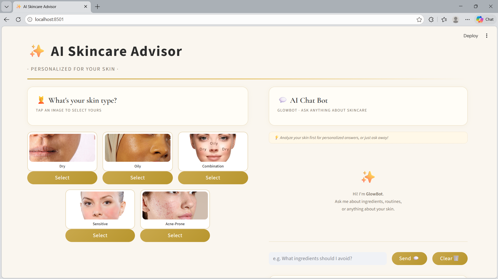

# ✨ AI Skincare Advisor

A beautiful Streamlit web app powered by **Groq API (LLaMA 3)** that analyzes your skin type and provides personalized skincare advice through an AI chatbot.
 


## 

## Project Structure


skincare\\\_app/
├── app.py              ← Main Streamlit application
├── agent.py            ← Groq API + AI logic (prompts, analysis, chatbot)
├── requirements.txt    ← Python dependencies
├── README.md           ← This file
└── assets/             ← Skin type images (place them here)
    ├── Dry\\\_Skin.png
    ├── Oily\\\_Skin.jpg
    ├── Combination\\\_Skin.webp
    ├── Sensitive\\\_Skin.webp
    └── Acne\\\_Skin.jpg


## Installation \& Running

```bash
# 1. Install dependencies
pip install -r requirements.txt

# 2. Run the app
streamlit run app.py
```

The app will open at **http://localhost:8501**


## 

## Features

|Feature|Description|
|-|-|
|Image-based skin selection|Click any skin type image to select it|
|AI Skin Analysis|Groq LLaMA 3 analyzes your skin profile|
|Structured Results|Oil level, sensitivity, acne risk, hydration|
|GlowBot Chatbot|Ask follow-up skincare questions with memory|
|Session Memory|Skin context used in all chatbot answers|
|Cream/Gold/Charcoal UI|Elegant, professional design|


## 

## Notes

* This app uses **Groq API** (NOT OpenAI) — it's free and very fast
* Model used: `llama3-8b-8192` (can be changed in `agent.py`)
* All advice is for **informational purposes only** — not medical advice


## Demo

[https://www.youtube.com/shorts/2SMTdm\_neD4](https://youtube.com/shorts/2SMTdm_neD4?si=37GhtGQnmNI8euCW)

